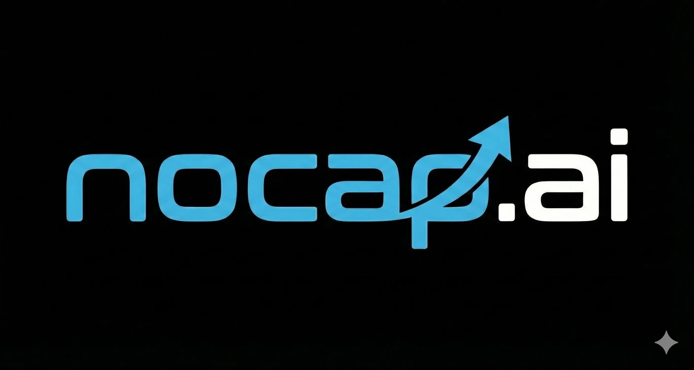

<div align="center">

  <picture>
    <source media="(prefers-color-scheme: dark)" srcset="asset/logo/Full-W.webp">
    <source media="(prefers-color-scheme: light)" srcset="asset/logo/Full-B.webp">
    
  </picture>

  <br/>
  
  <h1>nocap.ai</h1>
  <p>
    <b>No Cap, Just Data.</b><br>
    Platform analisis desain visual dan prediksi engagement untuk konten media sosial bertenaga AI.
  </p>

  <p>
    <a href="https://opensource.org/licenses/MIT">
      
    </a>
    <a href="https://bun.sh/">
      
    </a>
    <a href="https://elysiajs.com/">
      
    </a>
    <a href="https://fastapi.tiangolo.com/">
      
    </a>
    <a href="https://supabase.com/">
      
    </a>
    <a href="https://render.com/">
      
    </a>
  </p>

  <p><i>Generated by Gemini & Built by Humans</i></p>
</div>

---

## 📋 Daftar Isi

- [Tentang Proyek](#-tentang-proyek)
- [Fitur Utama](#-fitur-utama)
- [Teknologi (Tech Stack)](#-teknologi-tech-stack)
- [Arsitektur Sistem](#-arsitektur-sistem)
- [Prasyarat](#-prasyarat)
- [Instalasi & Penggunaan](#-instalasi--penggunaan)
- [Deployment](#-deployment)
- [Roadmap](#-roadmap)
- [Lisensi](#-lisensi)

---

## 📖 Tentang Proyek

**nocap.ai** adalah sebuah platform SaaS modern yang membantu pelaku usaha UMKM untuk mengaudit desain postingan media sosial mereka.

Menggunakan arsitektur _microservices_ yang efisien, nocap.ai menggabungkan kecepatan **Bun runtime** dengan kecerdasan model **XGBoost** untuk memprediksi _Engagement Score_ dan memberikan rekomendasi perbaikan visual yang objektif.

---

## ✨ Fitur Utama

| Fitur                      | Deskripsi                                                                         |
| :------------------------- | :-------------------------------------------------------------------------------- |
| **🔍 AI Visual Analysis**  | Mendeteksi objek, palet warna, dan komposisi menggunakan Computer Vision.         |
| **📈 Accurate Prediction** | Menggunakan algoritma **XGBoost** untuk prediksi tingkat engagement yang presisi. |
| **⚡ Real-time**           | Backend super cepat menggunakan Elysia.js dan Bun.                                |
| **☁️ Cloud Native**        | Penyimpanan data dan autentikasi terpusat menggunakan Supabase.                   |
| **💡 Smart Insights**      | Rekomendasi perbaikan otomatis untuk memaksimalkan potensi viralitas.             |

---

## 🛠 Tech Stack

Proyek ini menggunakan arsitektur _polyglot_ untuk memaksimalkan performa di setiap layanannya:

### 🎨 Frontend (Client)

- **Next.js 13+:** Framework React untuk UI yang interaktif dan SEO-friendly.
- **Tailwind CSS:** Utility-first CSS framework.
- **Bun:** Digunakan sebagai package manager dan runtime untuk script frontend.

### ⚡ Main Backend (Application Logic)

- **Elysia.js:** Framework backend modern yang berjalan di atas **Bun**. Menangani autentikasi, manajemen user, dan orkestrasi data.
- **Bun:** JavaScript runtime all-in-one yang sangat cepat.

### 🧠 ML Service (Microservice)

- **Python & FastAPI:** Digunakan khusus sebagai _inference server_ untuk model AI.
- **XGBoost:** Algoritma _Gradient Boosting_ utama untuk model prediksi engagement.
- **OpenCV:** Pemrosesan citra (Computer Vision).

### ☁️ Cloud & Infrastructure

- **Supabase:** Penyedia Backend-as-a-Service (PostgreSQL Database, Auth, Storage, Realtime).
- **Render:** Platform PaaS untuk deployment otomatis (Frontend, Backend, dan ML Service).

---

## 🏗 Arsitektur Sistem

Alur kerja data (Data Flow):

1.  **User Interface:** User berinteraksi melalui **Next.js**.
2.  **Auth & Data:** Semua data user dan file gambar disimpan di **Supabase**.
3.  **Orchestration:** Request analisis dikirim ke **Elysia.js (Bun)**.
4.  **Inference:** Elysia meneruskan data gambar ke **ML Service (FastAPI)**.
5.  **Processing:**
    - Fitur visual diekstrak.
    - **XGBoost** melakukan prediksi skor.
6.  **Response:** Hasil dikembalikan ke Elysia, disimpan di Supabase, dan ditampilkan ke User.

---

## ⚙ Prasyarat

Pastikan Anda telah menginstal:

- [Bun](https://bun.sh/) (v1.0+)
- [Python](https://www.python.org/) (v3.9+)
- Akun [Supabase](https://supabase.com/) (untuk URL & API Keys)
- Akun [Render](https://render.com/) (untuk deployment)

---

## 🚀 Instalasi & Penggunaan

Proyek ini terdiri dari 3 bagian utama: Frontend, Main Backend, dan ML Service.

### 1. Clone Repository

```bash
git clone [https://github.com/username/nocap.ai.git](https://github.com/username/nocap.ai.git)
cd nocap.ai
```
